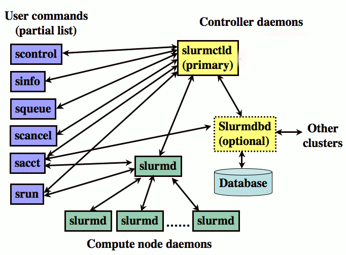
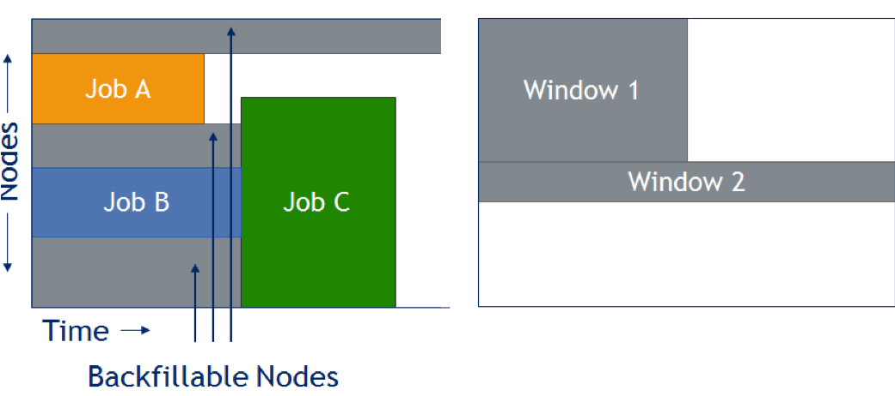

% Savio Slurm training: How job scheduling works
% November 9, 2020
% Nicolas Chan, Wei Feinstein, and Chris Paciorek


# Introduction

We'll do this mostly as a demonstration. We encourage you to login to your account and try out the various examples yourself as we go through them.

Much of this material is based on the extensive Savio documention we have prepared and continue to prepare, available at [https://research-it.berkeley.edu/services/high-performance-computing](https://research-it.berkeley.edu/services/high-performance-computing).

The materials for this tutorial are available using git at the short URL ([https://tinyurl.com/brc-nov20](https://tinyurl.com/brc-nov20)), the  GitHub URL ([https://github.com/ucb-rit/savio-training-slurm-2020](https://github.com/ucb-rit/savio-training-slurm-2020)), or simply as a [zip file](https://github.com/ucb-rit/savio-training-slurm-2020/archive/main.zip).

# How to get additional help

 - For technical issues and questions about using Savio:
    - brc-hpc-help@berkeley.edu
 - For questions about computing resources in general, including cloud computing:
    - brc@berkeley.edu
    - office hours: Wed. 1:30-3:00 and Thur. 9:30-11:00 [on Zoom](https://research-it.berkeley.edu/programs/berkeley-research-computing/research-computing-consulting)
 - For questions about data management (including HIPAA-protected data):
    - researchdata@berkeley.edu
    - office hours: Wed. 1:30-3:00 and Thur. 9:30-11:00 [on Zoom](https://research-it.berkeley.edu/programs/berkeley-research-computing/research-computing-consulting)

# Upcoming events and hiring

- Research IT is hiring graduate students as [domain consultants](https://research-it.berkeley.edu/brc/domain-consultant). Please talk to one of us if interested.
- [Sensitive Data](https://research-it.berkeley.edu/services/sensitive-and-protected-data): We are building a service and platform for researchers working with sensitive data. Secure VMs are available now and secure HPC cluster + storage are coming soon at a baseline capacity at no cost. Please get in touch if you are working with sensitive data.
- [Cloud Computing Meetup](https://www.meetup.com/ucberkeley_cloudmeetup/)
    - Monthly on last Tuesday
    - Next meeting on Tuesday November 24
- [Securing Research Data Working Group](https://dlab.berkeley.edu/working-groups/securing-research-data-working-group)
    - Monthly, next meeting Monday November 23


# Outline

This training session will cover the following topics:

- Submitting Jobs (Chris)
    - Parallel jobs
    - Other kinds of jobs
    - Checking on running jobs
    - Possible submission errors
- How Slurm Works (Wei)
    - Introduction to queueing on clusters
    - Slurm details
    - How Slurm is set up on Savio
- Common Queue Questions (Nicolas)
    - Why isn't my job running (yet)?
    - Estimating job start time
    - Making jobs run sooner
     

# The Savio cluster

Savio is a Linux cluster - by cluster we mean a set of computers networked together such that you can:

 1) access the system by logging into a "login node"
 2) access your files on the system from any of the computers
 3) run your computations across one or more of the "compute nodes"
    - your work might use parallelization to do computation on more than one CPU
    - you can also run "serial" jobs that use a single CPU

# Conceptual diagram of Savio

<center></center>

# Slurm's job

All computations are done by submitting jobs to the scheduling software that manages jobs on the cluster, called Slurm.

Why is this necessary? Otherwise your jobs would be slowed down by other people's jobs running on the same node. This also allows everyone to fairly share Savio.

Savio uses Slurm to:

 1) Allocate access to resources (compute nodes) for users' jobs
 2) Start and monitor jobs on allocated resources
 3) Manage the queue of pending jobs

We've recently updated our documentation to give more details about Slurm and how to troubleshoot your jobs. Please [start here](https://docs-research-it.berkeley.edu/services/high-performance-computing/user-guide/running-your-jobs/).

# Submitting jobs: accounts and partitions

When submitting a job, the main things you need to indicate are the project account you are using and the partition. Note that there is a default value for the project account, but if you have access to multiple accounts such as an FCA and a condo, it's good practice to specify it.

You can see what accounts you have access to and which partitions within those accounts as follows:

```
sacctmgr -p show associations user=SAVIO_USERNAME
```

Here's an example of the output for a user who has access to an FCA and a condo.
```
Cluster|Account|User|Partition|Share|GrpJobs|GrpTRES|GrpSubmit|GrpWall|GrpTRESMins|MaxJobs|MaxTRES|MaxTRESPerNode|MaxSubmit|MaxWall|MaxTRESMins|QOS|Def QOS|GrpTRESRunMins|
brc|co_stat|paciorek|savio2_1080ti|1||||||||||||savio_lowprio|savio_lowprio||
brc|co_stat|paciorek|savio2_knl|1||||||||||||savio_lowprio|savio_lowprio||
brc|co_stat|paciorek|savio2_bigmem|1||||||||||||savio_lowprio|savio_lowprio||
brc|co_stat|paciorek|savio2_gpu|1||||||||||||savio_lowprio,stat_gpu2_normal|stat_gpu2_normal||
brc|co_stat|paciorek|savio2_htc|1||||||||||||savio_lowprio|savio_lowprio||
brc|co_stat|paciorek|savio|1||||||||||||savio_lowprio|savio_lowprio||
brc|co_stat|paciorek|savio_bigmem|1||||||||||||savio_lowprio|savio_lowprio||
brc|co_stat|paciorek|savio2|1||||||||||||savio_lowprio,stat_savio2_normal|stat_savio2_normal||
brc|fc_paciorek|paciorek|savio2_1080ti|1||||||||||||savio_debug,savio_normal|savio_normal||
brc|fc_paciorek|paciorek|savio2_knl|1||||||||||||savio_debug,savio_normal|savio_normal||
brc|fc_paciorek|paciorek|savio2_gpu|1||||||||||||savio_debug,savio_normal|savio_normal||
brc|fc_paciorek|paciorek|savio2_htc|1||||||||||||savio_debug,savio_long,savio_normal|savio_normal||
brc|fc_paciorek|paciorek|savio2_bigmem|1||||||||||||savio_debug,savio_normal|savio_normal||
brc|fc_paciorek|paciorek|savio2|1||||||||||||savio_debug,savio_normal|savio_normal||
brc|fc_paciorek|paciorek|savio|1||||||||||||savio_debug,savio_normal|savio_normal||
brc|fc_paciorek|paciorek|savio_bigmem|1||||||||||||savio_debug,savio_normal|savio_normal||
```

If you are part of a condo, you'll notice that you have *low-priority* access to certain partitions. For example I am part of the statistics condo *co_stat*, which owns some 'savio2' nodes and 'savio2_gpu' nodes and therefore I have normal access to those, but I can also burst beyond the condo and use other partitions at low-priority (see below).

In contrast, through my FCA, I have access to the savio, savio2, big memory, HTC, and GPU partitions all at normal priority.

# Submitting a batch job

Let's see how to submit a simple job. If your job will only use the resources on a single node, you can do the following. 

Here's an example job script that I'll run. You'll need to modify the `--account` value and possibly the `--partition` value.

```bash
#!/bin/bash
# Job name:
#SBATCH --job-name=test
#
# Account:
#SBATCH --account=co_stat
#
# Partition:
#SBATCH --partition=savio2
#
# Wall clock limit (45 seconds here):
#SBATCH --time=00:00:45
#
## Command(s) to run:
module load python/3.6
python calc.py >& calc.out
```

# Monitoring jobs

Now let's submit and monitor the job:

```
sbatch job.sh

squeue -j <JOB_ID>

wwall -j <JOB_ID>
```

After a job has completed (or been terminated/cancelled), you can review the maximum memory used (and other information) via the sacct command.

```
sacct -j <JOB_ID> --format=JobID,JobName,MaxRSS,Elapsed
```

MaxRSS will show the maximum amount of memory that the job used in kilobytes.

You can also login to the node where you are running and use commands like *top* and *ps*:

```
srun --jobid=<JOB_ID> --pty /bin/bash
```

# Parallel job submission

If you are submitting a job that uses multiple nodes, you'll need to carefully specify the resources you need. The key flags for use in your job script are:

 - `--nodes` (or `-N`): indicates the number of nodes to use
 - `--ntasks-per-node`: indicates the number of tasks (i.e., processes) one wants to run on each node
 - `--cpus-per-task` (or `-c`): indicates the number of cpus to be used for each task

In addition, in some cases it can make sense to use the `--ntasks` (or `-n`) option to indicate the total number of tasks and let the scheduler determine how many nodes and tasks per node are needed. In general `--cpus-per-task` will be 1 except when running threaded code.  

Here's an example job script for a job that uses MPI for parallelizing over multiple nodes:

```bash
#!/bin/bash
# Account:
#SBATCH --account=account_name
#
# Partition:
#SBATCH --partition=partition_name
#
# Number of MPI tasks needed for use case (example):
#SBATCH --ntasks=40
#
# Processors per task:
#SBATCH --cpus-per-task=1
#
# Wall clock limit:
#SBATCH --time=00:00:30
#
## Command(s) to run (example):
module load intel openmpi
## This will run a.out using 40 (i.e., $SLURM_NTASKS) MPI tasks
mpirun ./a.out
```

# Slurm-related environment variables

When you write your code, you may need to specify information about the number of cores to use. Slurm will provide a variety of variables that you can use in your code so that it adapts to the resources you have requested rather than being hard-coded. 

Here are some of the variables that may be useful:

 - SLURM_NTASKS
 - SLURM_CPUS_PER_TASK
 - SLURM_CPUS_ON_NODE
 - SLURM_NODELIST
 - SLURM_NNODES

# Various kinds of parallel jobs

Some common paradigms are:

- 1 node, many CPUs
    - openMP/threaded jobs - 1 task, *c* CPUs for the task
    - Python/R/GNU parallel - many tasks, 1 per CPU at any given time
- many nodes, many CPUs
    - MPI jobs that use 1 CPU per task for each of *n* tasks, spread across multiple nodes
    - Python/R/GNU parallel - many tasks, 1 per CPU at any given time
- hybrid jobs that use *c* CPUs for each of *n* tasks
    - e.g., MPI+threaded code
   
There are lots more examples of job submission scripts for different kinds of parallelization (multi-node (MPI), multi-core (openMP), hybrid, etc.) [here](https://research-it.berkeley.edu/services/high-performance-computing/running-your-jobs#Job-submission-with-specific-resource-requirements).

# Parallel jobs: Threaded (e.g., openMP) job

```
#!/bin/bash
# Account:
#SBATCH --account=account_name
#
# Partition:
#SBATCH --partition=partition_name
#
# Specify one task:
#SBATCH --ntasks-per-node=1
#
# Number of processors for single task needed for use case (example):
#SBATCH --cpus-per-task=4
#
# Wall clock limit:
#SBATCH --time=00:00:30
#
## Command(s) to run (example):
export OMP_NUM_THREADS=$SLURM_CPUS_PER_TASK
./a.out
```

Also useful for parallel Python, MATLAB, or R code on one node.

Caution 1: this script will not use all the cores on a node!

Caution 2: threaded code may not scale well, so may not effectively use all cores on a node if only running one threaded process.

# Parallel jobs: Multi-process jobs

```
#!/bin/bash
# Account:
#SBATCH --account=account_name
#
# Partition:
#SBATCH --partition=partition_name
#
# Request one node:
#SBATCH --nodes=1
#
# Specify number of tasks for use case (example):
#SBATCH --ntasks-per-node=20
#
# Processors per task:
#SBATCH --cpus-per-task=1
#
# Wall clock limit:
#SBATCH --time=00:00:30
#
## Command(s) to run (example):
./a.out
```

Good for parallel Python, MATLAB, or R code on one node.

# Parallel jobs:  Multi-node jobs

```
#!/bin/bash
# Account:
#SBATCH --account=account_name
#
# Partition:
#SBATCH --partition=partition_name
#
# Number of nodes needed for use case:
#SBATCH --nodes=2
#
# Tasks per node based on number of cores per node (example):
#SBATCH --ntasks-per-node=20
#
# Processors per task (could change for hybrid threaded-multiprocess jobs):
#SBATCH --cpus-per-task=1
#
# Wall clock limit:
#SBATCH --time=00:00:30
#
## Command(s) to run (example):
./a.out
```

Useful for parallel Python, R, or MATLAB code run across multiple nodes.

Could also simply use --ntasks and let Slurm work out how many nodes are needed.

# GPU jobs

Most of the GPU partitions (e.g., savio2_gpu, savio2_1080ti, savio3_gpu, etc.) have multiple GPUs on each node.

  - You can request as many GPUs as your code will use.
  - You must request 2 CPUs for each GPU

```
#!/bin/bash
# Account:
#SBATCH --account=account_name
#
# Partition:
#SBATCH --partition=savio2_gpu
#
# Processors per task (please always specify the total number of processors twice the number of GPUs):
#SBATCH --cpus-per-task=2
#
#Number of GPUs, this can be in the format of "gpu:[1-4]", or "gpu:K80:[1-4] with the type included
#SBATCH --gres=gpu:1
#
# Wall clock limit:
#SBATCH --time=00:00:30
#
## Command(s) to run (example):
./a.out
```

# Low-priority queue

Condo users have access to the broader compute resource that is limited only by the size of partitions, under the *savio_lowprio* QoS (queue). However this QoS does not get a priority as high as the general QoSs, such as *savio_normal* and *savio_debug*, or all the condo QoSs, and it is subject to preemption when all the other QoSs become busy. 

More details can be found [in the *Low Priority Jobs* section of the user guide](https://research-it.berkeley.edu/services/high-performance-computing/user-guide/savio-user-guide#Low_Priority).

Suppose I wanted to burst beyond my condo to run on 20 nodes. 

First I'll see if there are that many nodes even available on the partition of interest.

```
sinfo -p savio
```

Here's the submission script.

```
#!/bin/bash
# Account:
#SBATCH --account=co_your_condo
#
# Partition:
#SBATCH --partition=savio
#
# Quality of Service:
#SBATCH --qos=savio_lowprio
#
#SBATCH --nodes=20
#
# Wall clock limit:
#SBATCH --time=00:00:30
#
## Command(s) to run:
echo "hello world"
```

# HTC jobs (and long-running jobs)

There is a partition called the HTC partition that allows you to request cores individually rather than an entire node at a time. The nodes in this partition are faster than the other nodes.

```
#!/bin/bash
# Account:
#SBATCH --account=account_name
#
# Partition:
#SBATCH --partition=savio2_htc
#
# Processors per task:
#SBATCH --cpus-per-task=4
#
# Wall clock limit:
#SBATCH --time=00:00:30
#
## Command(s) to run (example):
./a.out
```

 - Here I get 4 cores by asking for 4 cpus-per-task.
 - One could also do with --ntasks=4, but would need --nodes=1 to guarantee all cores are on one node.

**One can run jobs up to 10 days (using four or fewer cores) in this partition if you include `--qos=savio_long`.**

# Alternatives to the HTC partition for collections of serial jobs
 
You may have many serial jobs to run. It may be more cost-effective to collect those jobs together and run them across multiple cores on one or more nodes.

Here are some options:

  - using [GNU parallel](https://research-it.berkeley.edu/services/high-performance-computing/user-guide/running-your-jobs/gnu-parallel) to run many computational tasks (e.g., thousands of simulations, scanning tens of thousands of parameter values, etc.) as part of single Savio job submission
  - using [single-node parallelism](https://github.com/berkeley-scf/tutorial-parallel-basics) and [multiple-node parallelism](https://github.com/berkeley-scf/tutorial-parallel-distributed) in Python, R, and MATLAB
    - parallel R tools such as *future*, *foreach*, *parLapply*, and *mclapply*
    - parallel Python tools such as  *ipyparallel*, *Dask*, and *ray*
    - parallel functionality in MATLAB through *parfor*


# Some possible submission errors

Here are some errors that might result in your job never even being queued.

- Make sure account/partition/QoS combo is legitimate:

```
[paciorek@ln002 ~]$ srun -A co_stat -t 5:00 -q savio_normal -p savio3 --pty bash
srun: error: Unable to allocate resources: Invalid qos specification
```

- Request 2 CPUs for each GPU:

```
[paciorek@ln002 ~]$ srun -A ac_scsguest -t 5:00 -p savio2_gpu --gres=gpu:1 --pty bash
srun: error: Unable to allocate resources: Invalid generic resource (gres) specification
```

- Need to request FCA renewal or pay for extra service units:

```
[paciorek@ln002 ~]$  srun -A fc_paciorek -p savio2  -t 5:00 --pty bash
srun: error: This user/account pair does not have enough service units to afford this job's estimated cost

[paciorek@ln002 ~]$  check_usage.sh -a fc_paciorek
Usage for ACCOUNT fc_paciorek [2020-05-31T10:00:00, 2020-11-06T14:33:06]: 1 jobs, 0.05 CPUHrs, 0.05 SUs
                                                                       used from an allocation of 0 SUs.
```

However, in most cases, even if you provide invalid values, your job will be queued rather than immediately returning an error.  

# How Slurm works on Savio (Wei)
- Introduction to queueing on clusters
- Slurm details
- How Slurm is set up on Savio

# Slurm Overview
- An open source, fault-tolerant, and highly scalable cluster management and job scheduling system for large and small Linux clusters
- Manage job submission and scheduling on Savio
- Control user access to the resources on Savio, different partitions, project account...
- Manage the queue of pending jobs based on assigning priorities to jobs
- Optimize how jobs with different resource requirements can be accommodated 

# Slurm architecture


# Slurmdbd - database daemon
- A mysql database daemon runs on the master node
- Track all user account information
- Track all job information
- Track all configuration information 
    - partitions, qos, nodename and resources, all transactions...
- Commands used for this database: sacctmgr 

# Slurmd - Node management daemon 
- Run on all the compute nodes
- Track state of a node: down, up, idle, alloc
- Track resources available on a node
- Track jobs running on a node
- Launch and kill jobs on a node

# Slurmctld - control daemon runs on service node
- Communicate to SlurmBD for accounting information
- Communicate to SlurmD for state of the nodes
    - Available resources, state of nodes
    - What job should be scheduled to run on what node and semi-reserve that node for the job
- Read config files to determine how to configure Slurm, such as slurm.conf, gres.conf...
- Communicate and understand Slurm-plugins
    - spank_private_tmpshm
    - spank_collect_script
    - job_submit_collect_script
    - spank_slurm_banking
- Slurm Authentication: Munge 
- User commands: sacct, squeue, sinfo, sbatch, etc

# Job submission process
- Submit jobs: srun, sbatch, salloc 
- Job parameters validated 
- Prolog - setups environment variables - $TMPDIR
- Requested resources checked
- Job batched to slurmd node
- Job killed upon completion - epilog script ran to clean up processes

# Job prioritization factors

- Priority Plugins define Slurm’s behavior, Priority/multifactor - Sets priority based on:
- QOS: set to prioritize condo users first (1000000), debug (10000), normal (1000) and low_prio (0)
- Fairshare: usage and raw share
- Job age: the length of time a job has been waiting in the queue. max’s out at 1.0. The default is 7 days,
- Partition: same for all Savio partitions
- Prioroity = FAIRSHARE + QOS  + AGE 
- *sprio*: report components of job priority 

```
[root@master ~]# sprio -w
          JOBID PARTITION   PRIORITY        AGE  FAIRSHARE        QOS
        Weights                            1000    1000000   10000000
```
```
[root@master ~]# sprio 
          JOBID PARTITION   PRIORITY        AGE  FAIRSHARE        QOS
        6318009 savio2        186567       1000     184567       1000
        6673582 savio2_ht    1002000       1000    1000000       1000
        6746622 savio        1002000       1000    1000000       1000
        7109486 savio2_kn    1002070       1000       1071    1000000
        7121580 savio2_bi      31447       1000      30448          0
        7121581 savio2_bi      31447       1000      30448          0
        7129566 savio2_kn    1002070       1000       1071    1000000
        7140264 savio3       1017816       1000      16817    1000000
        7140767 savio2_kn    1002122       1000       1123    1000000
        7140988 savio3           516        491         26          0
        7141006 savio2_kn    1001416        319       1097    1000000

```

# Quality of Service (QoS)
 - Used to set resource limits at group, job, user levels:
    - Max node count
    - Max CPU
    - Max user submission
    - Max walltime
    - Job Scheduling Priority 
    - Job Preemption

```
[root@master ~]# sacctmgr show qos -p  format="Name,MaxTRES,MaxWall,MaxTRESPerUser%30,MaxJob,MaxSubmit,Priority,Preempt"
Name|MaxTRES|MaxWall|MaxTRESPU|MaxJobs|MaxSubmit|Priority|Preempt|
normal||||||1000||
savio_debug|node=4|00:30:00||||10000|savio_lowprio|
savio_normal|node=24|3-00:00:00||||1000|savio_lowprio|
savio_lowprio|node=24|3-00:00:00||||0||
astro_normal|node=16|||||1000000|savio_lowprio|
astro_debug|node=4|00:30:00||||10000000|savio_lowprio|
aiolos_normal||1-00:00:00||||1000000|savio_lowprio|
...
```

# Fairshare on Savio
 - Savio use Slurm's Fairshare system to prioritize amongst jobs in the queue.
 - Fairshare assign a numerical priority score to each job based on assigned shares and the effective usage. 
 - Usage: 
     - a value between 0.0 and 1.0 that represents your proportional usage of the system
     - quantified based on a standard decay schedule with a half-life of 14 days that downweights usage further in the past.
     - prioritizing groups and users who have not used Savio much recently over those who have
 - Raw Shares: assigned to each account/project by default 
     - 1.0 Similar to slices of a pie
     - represent the part of the system that is “yours” 
 -  Check fairshare scores

```
   sshare -la |head -1 ; sshare -al |grep user_name
   sshare -la |head -1 ; sshare -al |grep project_name
```

# Savio Partitions (queues)

```
[root@master ~]# grep -i partition /etc/slurm/slurm.conf
PriorityWeightPartition=0
PartitionName=savio           Nodes=n0[004-095,100-167].savio[1] 	         Oversubscribe=Exclusive DefMemPerNode=64000
PartitionName=savio_bigmem    Nodes=n0[096-099].savio[1]         	         Oversubscribe=Exclusive DefMemPerNode=512000
PartitionName=savio2          Nodes=n0[027-150,187-210,230-240,290-293].savio[2] Oversubscribe=Exclusive DefMemPerNode=63500
PartitionName=savio2_htc      Nodes=n0[000-011,215-222].savio[2]                 Oversubscribe=Yes       DefMemPerCPU=10600      LLN=Yes
PartitionName=savio2_gpu      Nodes=n0[012-026,223-224].savio[2]                 Oversubscribe=Yes       DefMemPerCPU=8000
PartitionName=savio2_bigmem   Nodes=n0[151-186,282-289].savio[2]                 Oversubscribe=Exclusive DefMemPerNode=128000
PartitionName=savio2_1080ti   Nodes=n0[227-229,298-302].savio[2]                 Oversubscribe=Yes       DefMemPerCPU=8000
PartitionName=savio2_knl      Nodes=n0[254-281,294-297].savio[2]                 Oversubscribe=Exclusive DefMemPerNode=190000
PartitionName=savio3_bigmem   Nodes=n0[006-009,030-041,166-169].savio[3]         Oversubscribe=Exclusive DefMemPerNode=360000  # 384 GB
PartitionName=savio3_xlmem    Nodes=n0[000-001].savio[3]                         Oversubscribe=Exclusive DefMemPerNode=1500000 #  1.5 TB
PartitionName=savio3_gpu      Nodes=n000[4-5].savio[3]                           Oversubscribe=Yes       DefMemPerCPU=8000     #  64 GB total / 8 cores
PartitionName=savio3_2080ti   Nodes=n0[134-138,143-145,158-161,174-176].savio[3] Oversubscribe=Yes       DefMemPerCPU=12000
# partitionName can only be defined once for any given name, so 4rtx and 8rtx cannot have separate def for DefMemPerCPU
PartitionName=savio3          Nodes=n0[010-029,042-125,126-133,139-142,146-149,150-157,170-173].savio[3] Oversubscribe=Exclusive DefMemPerNode=92000 
PartitionName=cortex          Nodes=n0[000-013].cortex[0]                        Oversubscribe=Yes       DefMemPerCPU=2000
PartitionName=vector          Nodes=n0[000-011].vector[0]                        Oversubscribe=Yes       DefMemPerCPU=4000
PartitionName=testbed         Nodes=n0[000-003].testbed[0]                       Oversubscribe=Exclusive DefMemPerNode=2000

```

# Backfill


 - Slurm is designed to perform a quick and simple scheduling attempt at frequent intervals:
    - Each job submission
    - Job completion on its allocated nodes
    - At configuration changes
 - Slurm parameters are configured to ensure backfill works: bf_window, bf_continue, bf_resolution
 - Backfill start lower priority jobs if by doing so does not delay the expected start time of any higher priority jobs
 - **Note**: accurate and reasonable run times is required for backfill to start lower priority jobs

 
# How priorities and queuing on Savio work (1)
 - Two primary ways to run jobs on Savio: under a faculty computing allowance (FCA) and under a condo.
 - Condo usage
     - Aggregated over all users of the condo, limited to at most the number of nodes purchased by the condo at any given time. 
     - Additional jobs will be queued until usage drops below that limit. 
     - The pending jobs will be ordered based on the Slurm Fairshare priority, with users with less recent usage prioritized.
     - Some circumstances, even when the condo's usage is below the limit, a condo job might not start immediately
       - Because the partition is fully used, across all condo and FCA users of the given partition. 
       - This can occur when a condo has not been fully used and FCA jobs have filled up the partition during that period of limited usage. 
       - Condo jobs are prioritized over FCA jobs in the queue and will start as soon as resources become available. 
       - Usually any lag in starting condo jobs under this circumstance is limited.

# How priorities and queuing on Savio work (2)
 - FCA jobs 
     - Start when they reach the top of the queue and resources become available as running jobs finish. 
     - The queue is ordered based on the Slurm Fairshare priority (specifically the Fair Tree algorithm). 
     - The primary influence on this priority is the overall recent usage by all users in the same FCA as the user submitting the job. 
     - Jobs from multiple users within an FCA are then influenced by their individual recent usage.
     - In more detail, usage at the FCA level (summed across all partitions) is ordered across all FCAs, 
        - Priority for a given job depends inversely on that recent usage (based on the FCA the job is using). 
        - Similarly, amongst users within an FCA, usage is ordered amongst those users, such that for a given partition, a user with lower recent usage in that partition will have higher priority than one with higher recent usage.


# Common Queue Questions (Nicolas)
- Why isn't my job running (yet)?
- When is my job expected to start?
- How can I get my job to start sooner?

# Why isn't my job running (yet)?

Could be for various reasons, including:

- Waiting for other higher priority jobs to finish
- Running this job would exceed a condo/QoS limit
- Incompatible parameters with the QoS (even though it made it to the queue)

# Introducing `sq`
We developed a new tool to diagnose issues:
```bash
module load sq
sq
```
You can also use it as an `squeue` replacement:
```bash
sq -aq
```

# `sq` Example Scenarios
 - The job would intersect with downtime so the job will run _after_ the downtime
 - Condo users have a fixed number of nodes with their condo QoS
    - Try using `savio_lowprio` QoS
 - Job is requesting longer wall-clock time than is allowed (`QOSMaxWallDurationPerJobLimit`)

# `sq` Demo
Demo QOSGrp
```bash
sq -u "$(squeue -o %all -P | grep -i qosgrp | cut -d'|' -f21 | shuf | head -n1)"
```

# `squeue`

 - If you need more specific information, you can use Slurm's own `squeue`.
     - `REASON` are explained in `man squeue`
  
# Common `REASON`
- `PRIORITY` - There are other higher priority jobs being allocated nodes
- `RESOURCES` - This job is next in priority and is waiting for available nodes

# When is my job expected to start? (PENDING)
Check how many other pending jobs there are in the queue:
```bash
squeue -p savio2 --state=PD -l -O JOBID,PARTITION,NAME,USERNAME,STATE,TIMELIMIT,REASON,PRIORITY
```
Higher priority means it will try to run sooner.

# When is my job expected to start? (RESOURCES)
If status is `RESOURCES`, you may check:
```bash
squeue --start -u $USER
```
to get an _estimated_ start time.

# How can I get my job to start sooner?
 - Shorten the time limit. Slurm may be able to fit a shorter job in a small gap between other jobs.
 - Request fewer nodes (or cores on partitions scheduled by cores). Perhaps there are a few nodes available right now but you would have to wait for other jobs to release other nodes if you wanted more.
 - Choose condo QoS if possible for higher priority.
 - Choose a partition with more idle nodes
    - `sinfo -o %P,%A` (Partition, Allocated/Idle)
    - View on our [Savio status dashboard](https://grafana.brc.berkeley.edu/d/pkIFHJAik/job-planning?orgId=2)
 - High recent usage decreases FCA priority.

